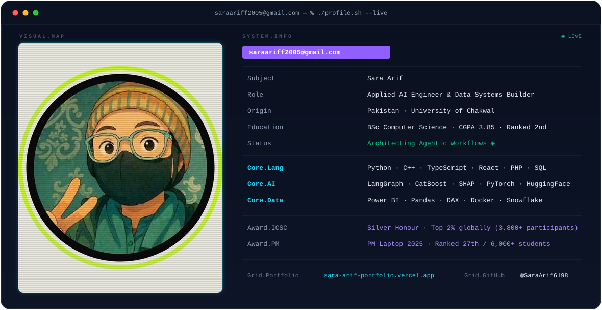
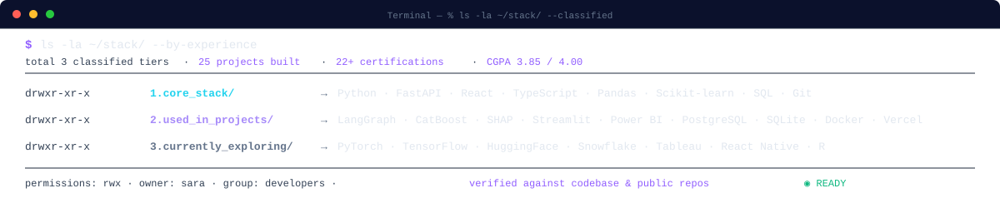
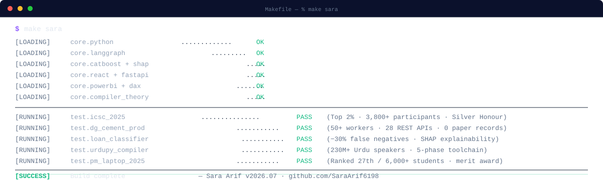

<!-- ===== TERMINAL PROFILE BANNER (WITH NATIVE SVG PIXEL ART PHOTO) ===== -->

  

 

<!-- ===== PORTFOLIO BADGE + PROFILE VIEWS ===== -->

  
  &nbsp;
  

<!-- ===== TYPING SVG ===== -->

  

 

<!-- ===== TECH STACK: ls -la ~/stack/ ===== -->

  

<!-- ===== TECH BADGES (grouped by category) ===== -->

**⚡ AI &amp; Machine Learning**

**🌐 Web &amp; API**

**📊 Data &amp; BI**

**💻 Languages &amp; Compiler**

**🛠 Dev Tools**

 

<!-- ===== FLAGSHIP PROJECTS ===== -->

  

 

<!-- ===== MOST USED LANGUAGES ===== -->

<picture>
  <source media="(prefers-color-scheme: dark)"
    srcset="https://github-readme-stats-sigma-rosy-28.vercel.app/api/top-langs/?username=SaraArif6198&layout=compact&langs_count=8&hide_border=true&title_color=915EFF&text_color=94A3B8&bg_color=0A101F&card_width=900" />
  
</picture>

 

<!-- ===== CONTRIBUTION SNAKE ===== -->

<picture>
  <source media="(prefers-color-scheme: dark)"
    srcset="https://raw.githubusercontent.com/SaraArif6198/SaraArif6198/output/snake-dark.svg" />
  <source media="(prefers-color-scheme: light)"
    srcset="https://raw.githubusercontent.com/SaraArif6198/SaraArif6198/output/snake-light.svg" />
  
</picture>

 

<!-- ===== MAKEFILE BUILD OUTPUT ===== -->

  

 

<!-- ===== OPEN FOR / AVAILABILITY ===== -->

&nbsp;

&nbsp;

&nbsp;

 

<!-- ===== SOCIAL BADGES ===== -->

&nbsp;&nbsp;

&nbsp;&nbsp;

&nbsp;&nbsp;

 

---

  ✨ Engineered with precision by <a href="https://sara-arif-portfolio.vercel.app/" target="_blank">Sara Arif</a> ✨

